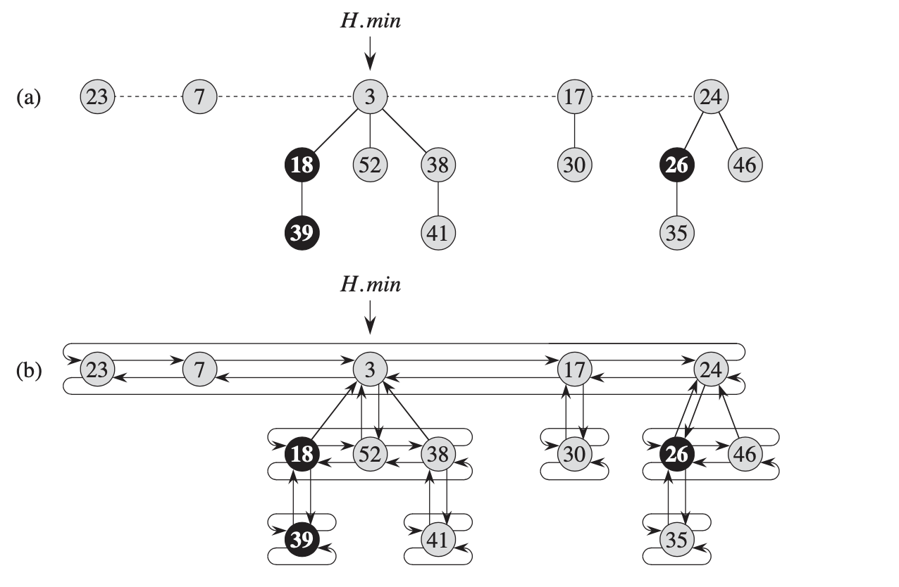
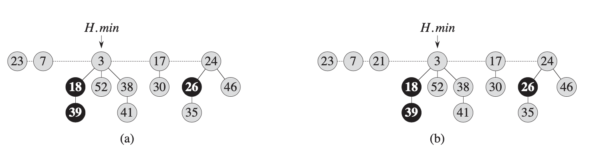
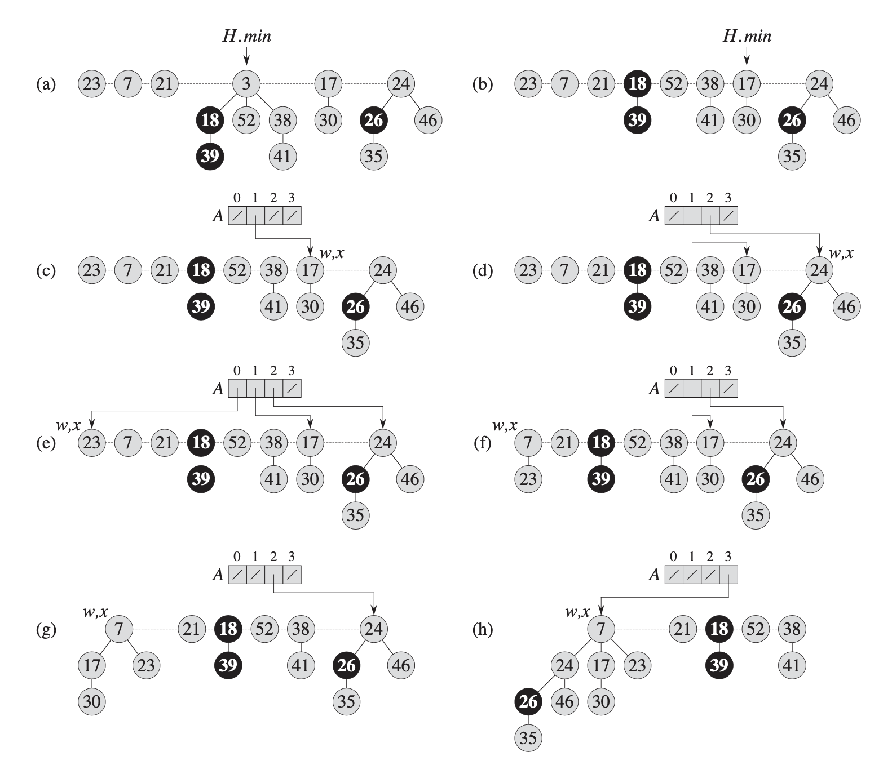
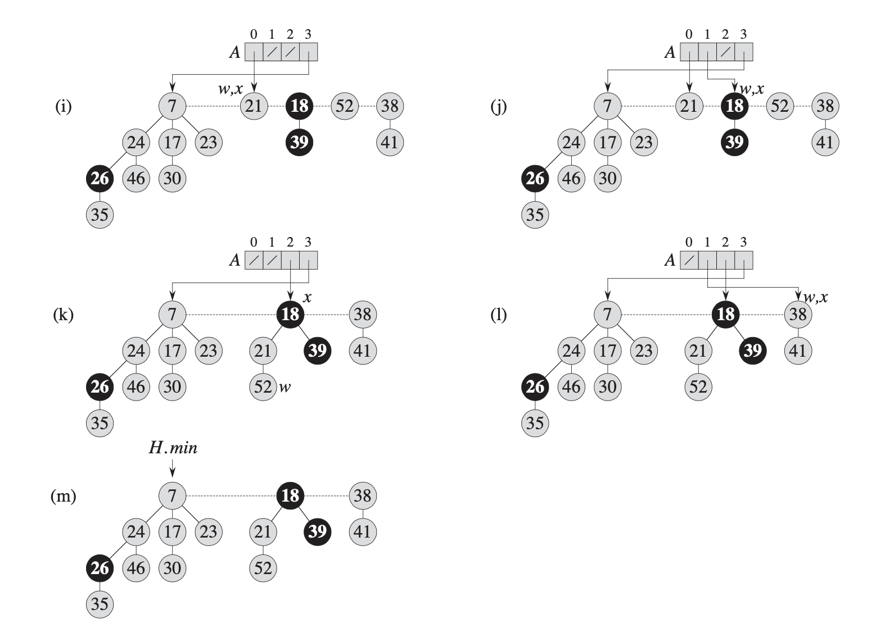
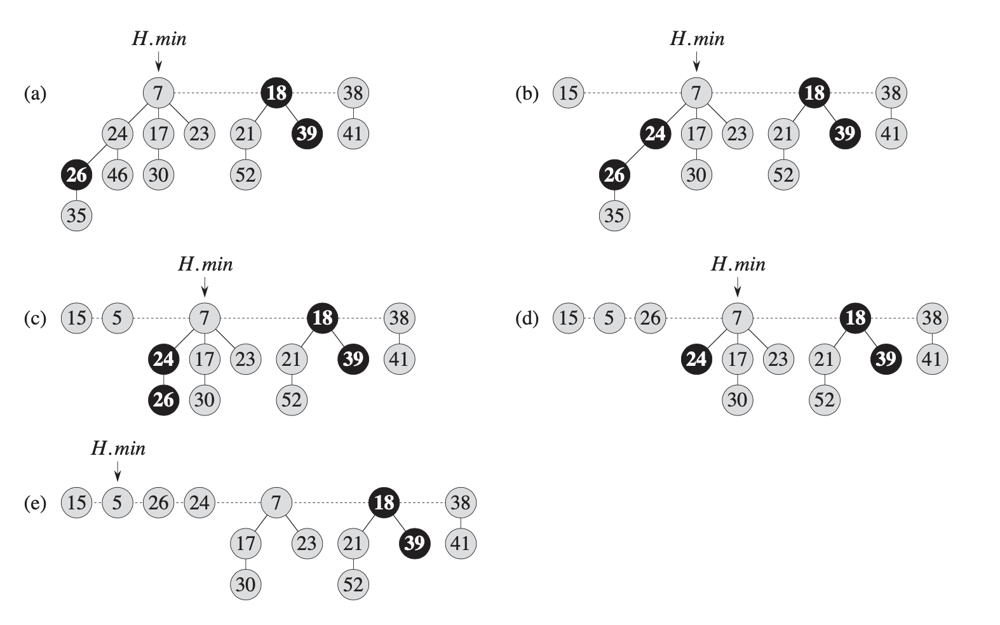

FIBONACCI HEAP
---



Mergeable Heaps:
- MAKE-HEAP()
- INSERT(H, x)
- MINIMUM(H)
- EXTRACT-MIN(H)
- UNION(H1, H2)


Fibonacci Heap:
- x.p  : 父节点 
- x.child : 子节点
- x.left, x.right : 兄弟节点
- x.degree : 节点的度，第一级子节点的数量
- x.mark : 子节点是否被cut的标记，用于decrease操作


INSERT
---



```python
FIB-HEAP-INSERT(H, x)
    x.degree = 0
    x.p = NIL
    x.child = NIL
    x.mark = FALSE
    if H.min == NIL
        create a root list for H containning just x
        H.min = x
    else
        insert x into H's root list (H.min's left)
            if x.key < H.min.key
                H.min = x
    H.n = H.n + 1
```

UNION
---

```python
FIB-HEAP-UNION(H1, H2)
    H = MAKE-FIB-HEAP()
    H.min = H1.min
    concatenate the root list of H2 with the root list of H
    if (H1.min == NIL) or (H2.min != NUL and H2.min.key < H1.min.key>)
        H.min = H2.min
    H.n = H1.n + H2.n
    return H
```

EXTRACT-MIN
---




```python
FIB-HEAP-EXTRACT-MIN(H)
    z = H.min
    if z != NIL
        for each child x of z
            add x to the root list of H
            x.p = NIL
        remove z from the root list of H
        if z == z.right
            H.min = NIL
        else
            H.min = z.right
            CONSOLIDATE(H)
        H.n = H.n - 1
    return z

CONSOLIDAE(H)
    let A[0..D(H.n)] be a new array
    for i = 0 to D(H.n)
        A[i] = NIL
    
    for each node w in the root list of H
        x = w
        d = x.degree
        while A[d] ! = NIL
            y = A[d]
            if x.key > y.key
                exchange x with y
            FIB-HEAP-LINK(H, y, x)
            A[d] = NIL
            d = d + 1
        A[d] = x

    H.min = NIL
    for i = 0 to D(H.n)
        if A[i] != NIL
            if H.min == NIL
                create a root list for H containning just A[i]
                H.min = A[i]
            else
                insert A[i] into H's root list
                if A[i].key < H.min.key
                    H.min = A[i]

FIB-HEAP-LINK(H, y, x)
    remove y from the root list of H
    make y a child of x, incrementing x.degree
    y.mark = FALSE
```

DECREASE
---



```python
FIB-HEAP-DECREASE(H, x, k)
    if k > x.key
        error "new key is greater than current key"
    x.key = k
    y = x.p
    if y != NIL and x.key < y.key
        CUT(H, x, y)
        CASCADING-CUT(H, y)
    
    if x.key < H.min.key
        H.min = x
    
CUT(H, x, y)
    remove x from child list of y, decrementing y.degree
    add x to the root list of H
    x.p = NIL
    x.mark = FALSE

CASCADING-CUT(H, y)
    z = y.p
    if z != NIL
        if y.mark == FALSE
            y.mark = TRUE
        else
            CUT(H, y, z)
            CASCADING-CUT(H, z)
```

DELETE
---

```python
FIB-HEAP-DELETE(H, x)
    FIB-HEAP-DECREASE-KEY(H, x, -infinity)
    FIB-HEAP-EXTRACT-MIN(H)
```

