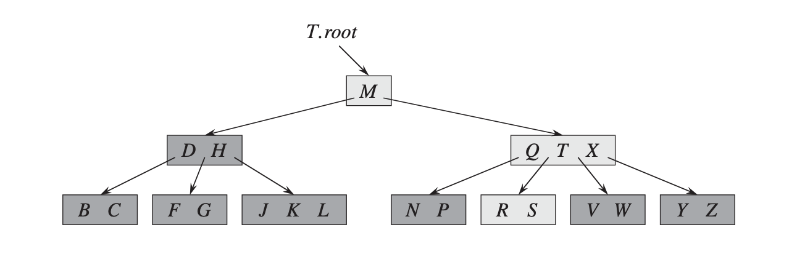
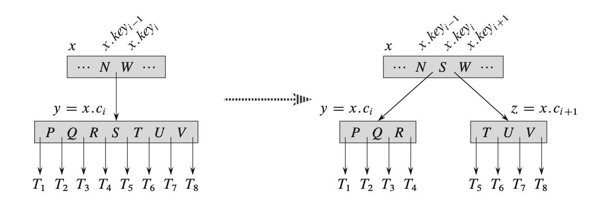
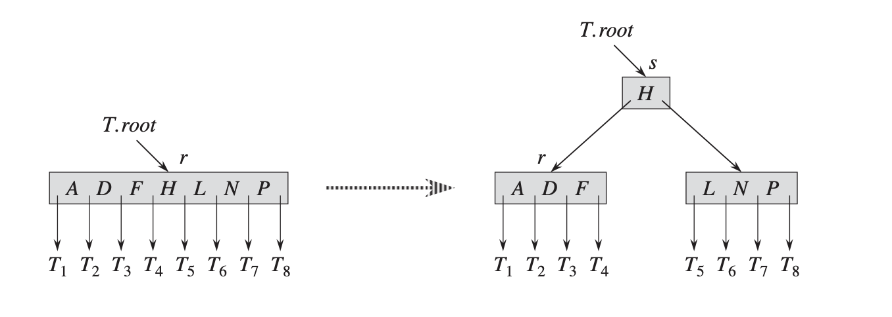
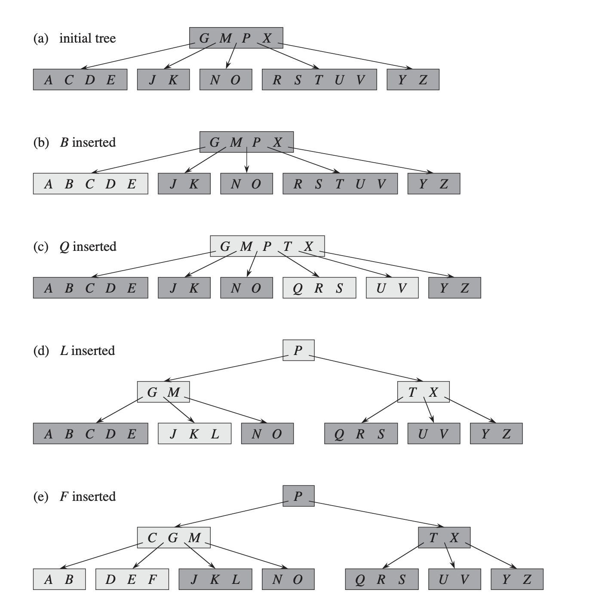
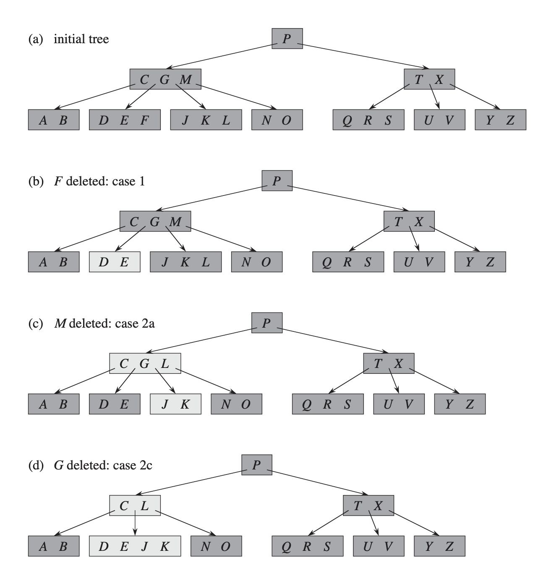
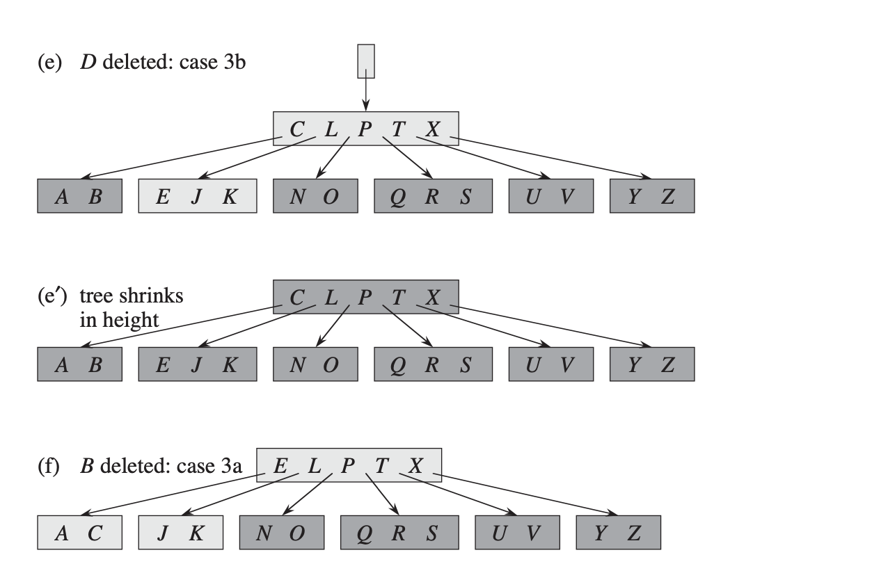

B树
--



性质：

1、每个节点x，有：
  - 包含n个key, 数量为x.n
  - x.key1 <= x.key2 <= .. <- x.keyn
  - x.leaf true - 叶子  false - 非叶子节点

2、每个内节点x，包含x.n + 1个子节点：x.c1, x.c2, ..., x.cn

3、x.key[i]把子树中的键值范围分开，假设k[i]是紫薯x.c[i]中的任意一个key，有：

     k1 <= x.key1 <= k2 <= x.key2 <= ... <= k[x.n + 1]

4、所有的叶子有同样的高度h

5、节点包含的key数量有上下限：```[t-1, 2t-1]```，t是最小度(minimum degree)

其中：```h <= log(t,((n+1)/2))```

检索
--

```python

B-TREE-SEARCH(x, k)
    i = 1
    while i <= x.n and k > x.key[i]
        i = i + 1
    
    if i <= x.n and k == x.key[i]
        return (x, i)
    elif x.leaf
        return NIL
    else
        DISK-READ(x.c[i])
            return B-TREE-SEARCH(x.c[i], k)
```


插入
--

创建B树：

``` python
B-TREE-CREATE(T)
    x = ALLOCATE-NODE()
    x.leaf = TRUE
    x.n = 0
    DISK-WRITE(x)
    T.root = x
```

拆分子节点：


``` python
B-TREE-SPLIT-CHILD(x, i)
    z = ALLOCATE-NODE()
    y = x.c[i]
    z.leaf = y.leaf
    z.n = t - 1
    for j = 1 to t - 1
        z.key[j] = y.key[j + t]
    if not y.leaf
        for j = 1 to t
            z.c[j] = y.c[j + t]

    y.n = t - 1
    for j = x.n+1 downto i + 1
        x.c[j+1] = x.c[j]
    x.c[i+1] = z
    for j = x.n downto i
        x.key[j+1] = x.key[j]
    x.key[i] = y.key[t]
    x.n = x.n + 1
    DISK-WRITE(y)
    DISK-WRITE(z)
    DISK-WRITE(x)
```

插入：




```python
B-TREE-INSERT(T, k)
    r = T.root
    if r.n == 2t - 1
        s = ALLOCATE-NODE()
        T.root = s
        s.leaf = FALSE
        s.n = 0
        s.c[1] = r
        B-TREE-SPLIT-CHILD(s, 1)
        B-TREE-INSERT-NOFULL(s, k)
    else
        B-TREE-INSERT-NOFULL(r, k)

B-TREE-INSERT-NOFULL(x, k)
    i = x.n
    if x.leaf
        while i >= 1 and k < x.key[i]
            x.key[i+1] = x.key[i]
            i = i - 1
        x.key[i+1] = k
        x.n = x.n + 1
        DISK-WRITE*(x)
    else
        while i >= 1 and k < x.key[i]
            i = i - 1
        i = i +1
        DISK-READ(x.c[i])
        if x.c[i].n == 2t - 1
            B-TREE-SPLIT-CHILD(x, i)
            if k > x.key[i]
                i = i + 1
        B-TREE-INSERT-NOFULL(x.c[i], k)
```

删除
--





变种
---
- B+ : <https://en.wikipedia.org/wiki/B%2B_tree>
- B* : <https://en.wikipedia.org/wiki/B-tree#Variants>
- 2-3树 : <https://en.wikipedia.org/wiki/2%E2%80%933_tree>
- 2-3-4树 : <https://en.wikipedia.org/wiki/2%E2%80%933%E2%80%934_tree>