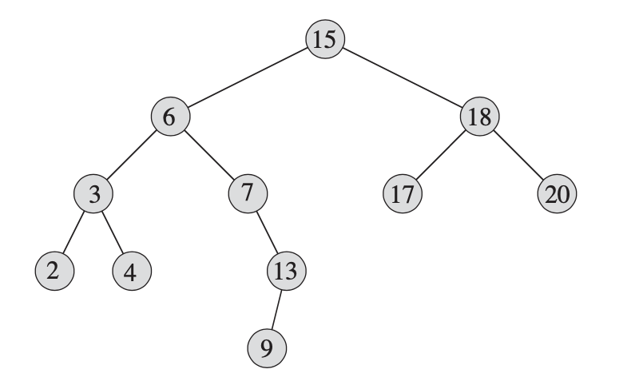
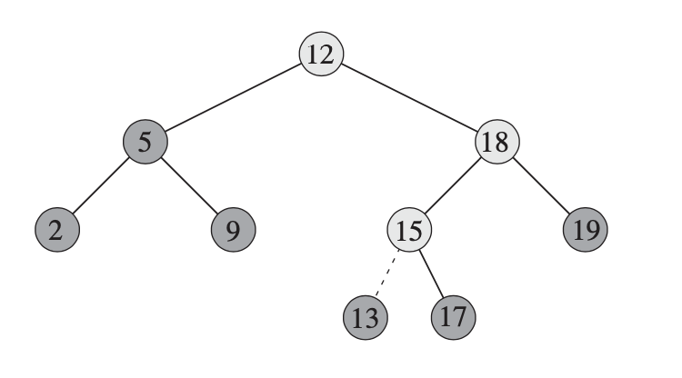
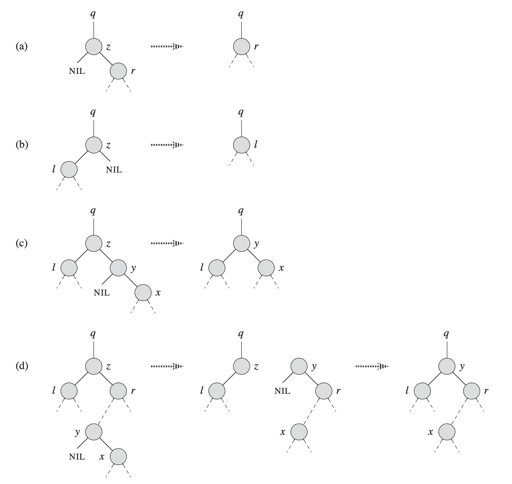

二叉搜索树（Binary Search Tree）
----

性质:
> node x, x.key >= left.key and x.key <= right.key

举例:


操作（Operations）
----

### 中序遍历

复杂度：theta(n)

```python
# 从小到大顺序输出
INORDER-TREE-WALK(x)
    INORDER-TREE-WALK(x.left)
    print x.key
    INORDER-TREE-WALK(x.right)
```

### 查找

复杂度：O(h)  h-树的高度

```python
TREE-SEARCH(x, k)
    if x == NIL or k == x.key
        return x
    if k < x.key
        return TREE-SEARCH(x.left, k)
    else
        return TREE-SEARCH(x.right, k)
```

or

```python
ITERATIVE-TREE-SEARCH(x, k)
    while x != NIL and k != x.key
        if k < x.key
            x = x.left
        else
            x = x.right
    return x   
```

### 最大/最小

复杂度：O(h)  h-树的高度

```python

# 最小：最左子节点
TREE-MINIMUM(x)
    while x.left != NIL
        x = x.left
    return x

# 最大：最右子节点
TREE-MAXNUM(x)
    while x.right != NIL
        x = x.right
    return x

```

### 前继/后续

复杂度：O(h)  h-树的高度

```python
TREE-SUCCESSOR(x)
    # 若有右子树，则为右子树的最左节点
    if x.right != NIL
        return TREE-MINIMUM(x.right)

    # y是x的父节点
    # 1.若x是y的左节点，则y就是succesor
    # 2.否则沿着父节点向上，直到x是y的右子节点
    y = x.p
    while p != NIL and x == y.right
        x = y
        y = y.p
    return y

TREE-PREDCESSOR(x)
    if x.left != NIL
        return TREE-MAXIMUM(x.left)

    y = x.p
    while p != NIL and x == y.left
        x = y
        y = y.p
    return y
```

### 插入

复杂度：O(h)  h-树的高度



```python
TREE-INSERT(T, z)

    # y是x的父节点
    y = NIL
    x = T.root

    # 找到合适的位置
    while x != NIL
        y = x
        if z.key < x.key
            x = x.left
        else
            x = x.right

    # 插入节点
    z.p = y
    if y == NIL
        T.root = z    # tree T was empty
    elif z.key < y.key
        y.left = z    # z是左子节点
    else
        y.right = z   # z是右子节点
```

### 删除

复杂度：O(h)  h-树的高度

思路：


> 1、叶子直接删除   
> 2、只有一个子树，直接用子树替换  
> 3、若有两个子树，用SCCESSOR替换



```python

# 使用节点v替换u节点, v的左右子节点由调用者确定
TRANSPLANT(T, u, v)
    if u.p == NIL
        T.root = v     # u是根节点
    elif u == u.p.left 
        u.p.left = v   # u是左子节点
    elif u == u.p.right
        u.p.right = v  # u是右子节点
    if v != NIL
        v.p = u.p

# 删除节点
TREE-DELETE(T, z)
    if z.left = NIL
        TRANSPLANT(T, z, z.right)  # 左子节点为空(a)
    elif z.right = NIL
        TRANSPLANT(T, z, z.left)   # 右子节点为空(b)
    else
        # y是z的succesor
        y = TREE-MINIMUM(z.right)

        # 若z不是y的父节点(d)
        if y.p != z
            TRANSPLANT(T, y, y.right)
            y.right = z.right
            y.right.p = y

        # 使用y替换z(c和d的第二步)
        TRANSPLANT(T, z, y)
        y.left = z.left
        y.left.p = y
        
```