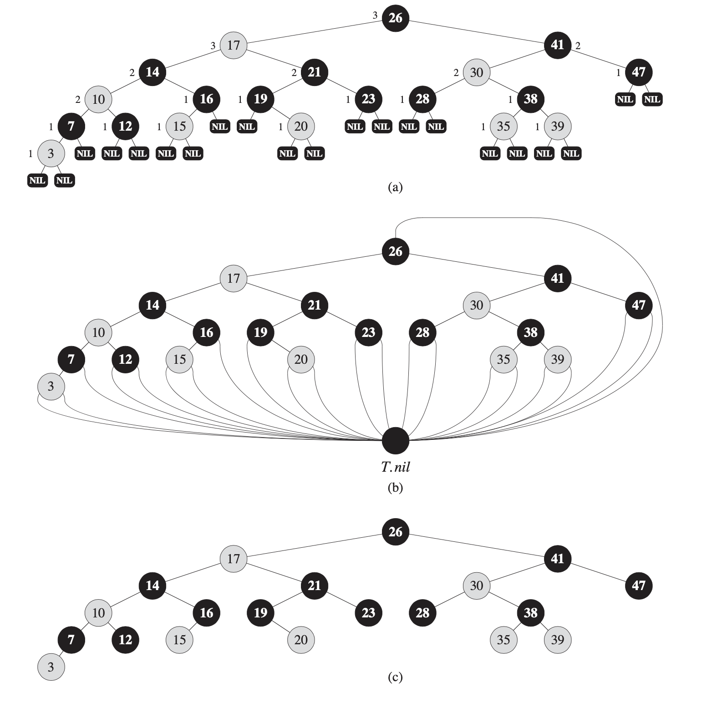
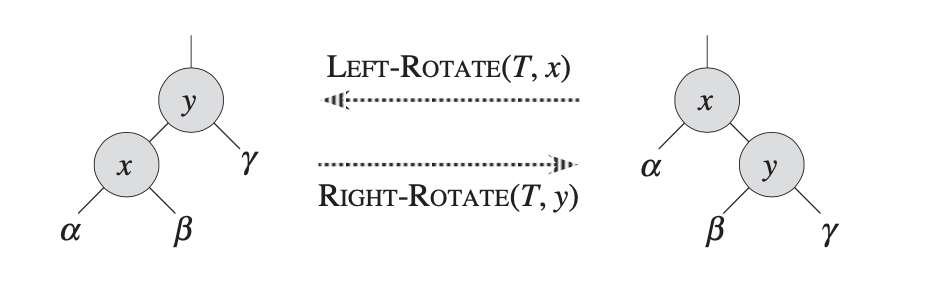
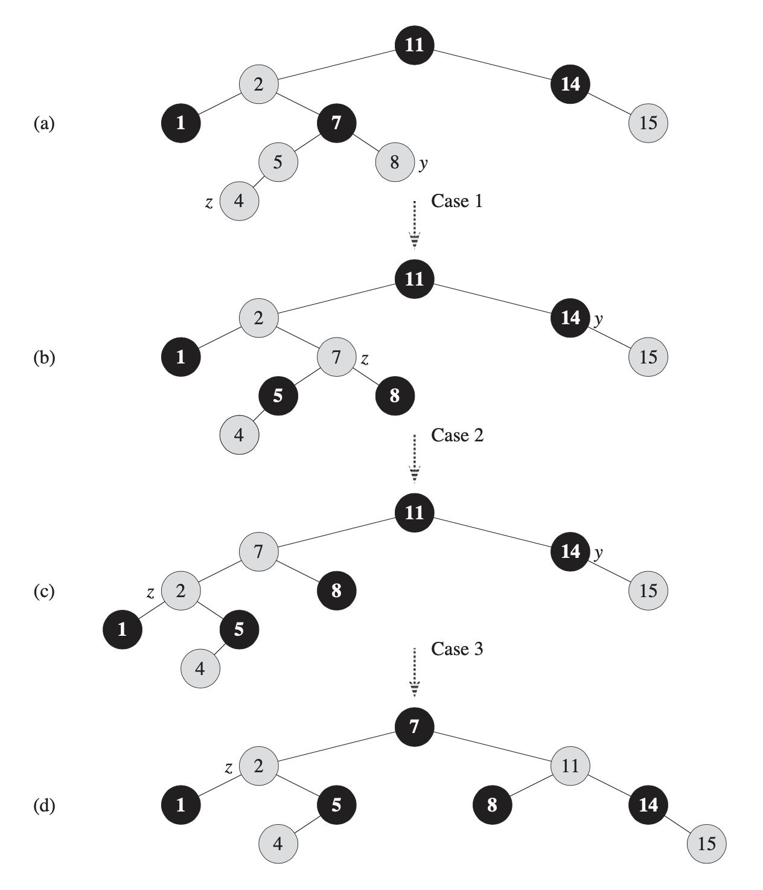
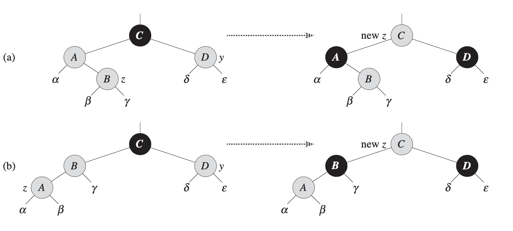
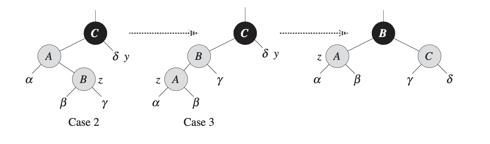
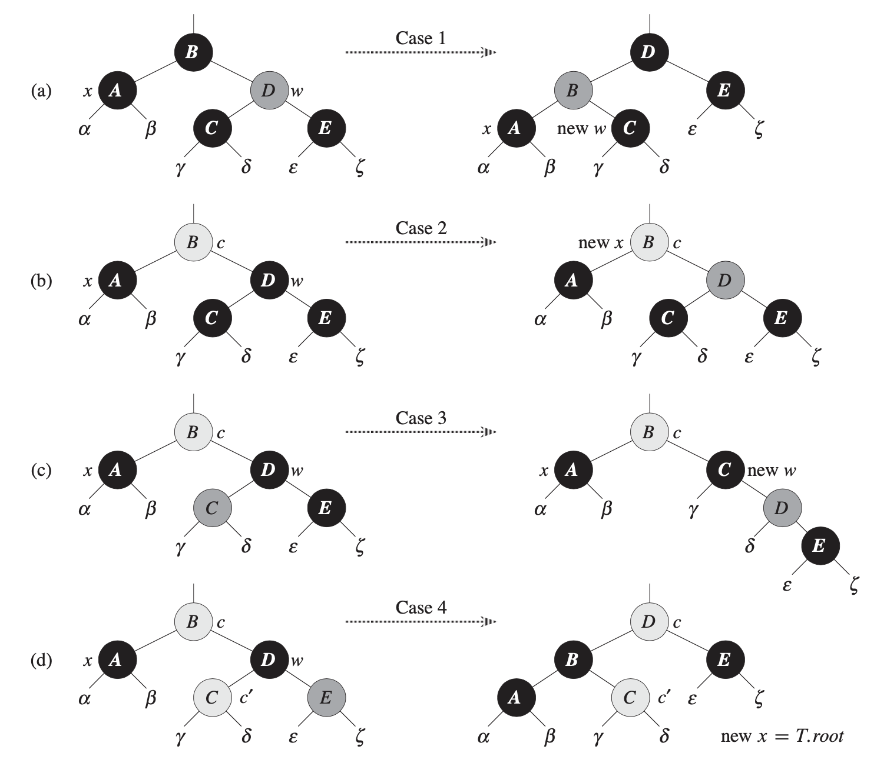

红黑树（Red-Black Tree）
---

性质：

1. 任何一个节点非红即黑
2. 根结点是黑色
3. 叶子节点是黑色
4. 红色节点的两个子节点必须是黑色
5. 黑高度相同：任何一个节点，所有到该子树叶子节点的简单路径，包含同样数量的黑色节点




旋转
---



```python
LEFT-ROTATE(T, x)
    y = x.right       # set y

    # turn y's left subtree into x's right subtree
    x.right = y.left  # 
    if y.left != T.nil
        y.left.p = x

    # link x's parent to y
    y.p = x.p
    if x.p == T.nil
        T.root = y
    elif x == x.p.left
        x.p.left = y
    else 
        x.p.right = y

    # put x on y's left
    y.left = x
    x.p = y
```

插入
---

一个完整的插入过程：




算法：

```python
RB-INSERT(T, z)
    y = T.nil
    x = T.root
    while x != T.nil
        y = x
        if z.key < x.key
            x = x.left
        else
            x = x.right
    
    z.p = y
    if y == T.nil
        T.root = z
    elif z.key < y.key
        y.left = z
    else
        y.right = z
    
    z.left = T.nil
    z.right = T.nil
    z.color = RED

    RB-INSERT-FIXUP(T, z)

RB-INSERT-FIXUP(T, z)
    while z.p.color == RED
        if z.p == z.p.p.left
            # y是z的uncle节点
            y = z.p.p.right 

            # case1: z's uncle is red
            if y.color == RED       
                z.p.color = BLACK
                y.color = BLACK
                z.p.p.color = RED
                z = z.p.p
            else
                # case2: z's uncle is black and z is a right child
                if z == z.p.right 
                    z = z.p
                    LEFT-ROTATE(T, z)
                # case3: z's uncle is black and z is a left child
                z.p.color = BLACK   # case3
                z.p.p.color = RED
                RIGHT-ROTATE(T, z.p.p)
        else
            (same as then clause with 'right' and 'left' exchange)

```

Case1：


Case2->Case3：


删除
---



```python

RB-TRANSPLANT(T, u, v)
    if u.p == T.nil
        T.root = v
    elif u == u.p.left
        u.p.left = v
    else
        u.p.right = v
    v.p = u.p

RB-DELETE(T, z)
    y = z
    y-original-color = y.color
    if z.left == T.nil
        x = z.right
        RB-TRANSPLANT(T, z, z.right)
    elif z.right == T.nil
        x = z.left
        RB-TRANSPLANT(T, z, z.left)
    else
        y = TREE-MINIMUM(z.right)
        y-original-color = y.color
        x = y.right
        if y.p == z
            x.p == y
        else
            RB-TRANSPLANT(T, y, y.right)
            y.right = z.right
            y.right.p = y
        RB-TRANSPLANT(T, z, y)
        y.left = z.left
        y.left.p = y
        y.color = z.color
    
    if y-original-color == BLACK
        RB-DELETE-FIXUP(T, x)

RB-DELETE-FIXUP(T, x)
    while x != T.root and x.color == BLACK
        if x == x.p.left
            # sibling
            w = x.p.right  

            # case1: x's sibling w is red (case1-> 2、3、4)
            if w.color == RED
                w.color = BLACK
                x.p.color = RED
                LEFT-ROTATE(T, x, p)
                w = w.p.right
            
            # case2: x's sibling w is black, and both of w's children are black
            if w.left.color == BLACK and w.right.color == BLACK
                w.color == RED
                x = x.p
            else
                # case3: x's sibling w is black, w's left child is red, and w's right child is black (case3->case4)
                if w.right.color == BLACK
                    w.left.color = BLACK
                    w.color = RED
                    RIGHT-ROTATE(T, w)
                    w = x.p.right
                    
                # case4: x'ssibling w is black, and w's right child is red
                w.color = x.p.color
                x.p.color = BLACK
                w.right.color = BLACK
                LEFT-ROTATE(T, x.p)
                x = T.root
        else
            (same as then clause with 'right' and 'left' exchange)


```